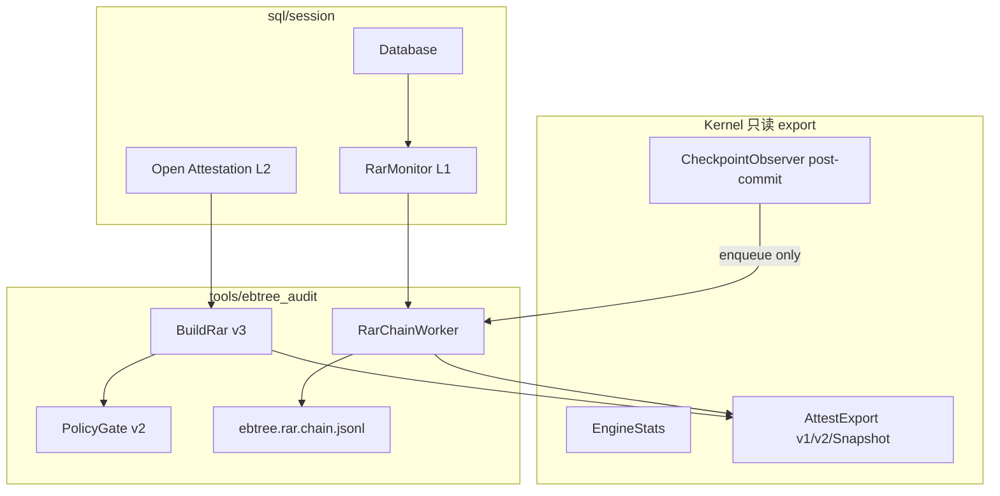

# RAR / RAR+Kernel 已实现功能归档

**归档日期**：2026-07-01  
**状态**：内核联动 + 动态链（ADR-038）初版快照。  
**最新归档**（Standard SKU 产品化）：[rar-product-implementation-2026-07-01.md](rar-product-implementation-2026-07-01.md)  
**规范入口**：[ADR-038](../../adr/038-rar-kernel-full-auditability.md) · [ADR-040](../../adr/040-rar-standard-sku-defaults.md) · [ADR-026](../../adr/026-rar-v2-signing-and-sidecars.md)

---

## 1. 能力总览

RAR（Recovery Attestation Report）是 eB-Tree 在**不进入内核写路径**的前提下，对物理层、恢复路径、契约一致性进行离线/在线审计的报告体系。与 kernel 的联动遵循 ADR-024 白名单：内核只 export 只读 struct + counter，JSON/Policy/Chain 组装在 `tools/ebtree_audit` 与 `sql/session`。

| 层级 | 名称 | 触发时机 | 已实现 |
|------|------|----------|--------|
| **L0** | 被动 async chain | 每次 `Checkpoint()` superblock commit 后 | ✅ |
| **L1** | MONITOR 软调控 | 运行期 stats 违规 | ✅ |
| **L2** | REQUIRE_PASS / ALLOW_WARN | SQL Open 同步 BuildRar | ✅（Phase 1 起） |
| **离线** | physical / attest / verify CLI | 工具手动调用 | ✅ |
| **签名** | Ed25519 canonical JSON | `EBTREE_RAR_SIGNING=ON` | ✅ |



---

## 2. 内核层（`cpp/`）

### 2.1 EngineStats 审计相关字段

文件：`cpp/include/ebtree/common/config.h`

| 字段 | 含义 | 写入点 |
|------|------|--------|
| `unexpected_path_total` | 禁止读路径命中累计 | read resolver 等 |
| `fallback_read_total` | fallback 读累计 | 禁止路径 |
| `decompress_fail_total` | datafile 解压失败累计 | `datafile.cc` `DecodeRecordValue` |
| `rar_chain_drop_total` | async chain 队列满丢弃次数 | `RarChainWorker::Enqueue` |
| `compress_bytes_in/out` | 压缩字节统计 | codec 路径 |
| `pages_touched` | 页访问计数 | 读路径 |
| `stable_lsn` | 当前稳定 LSN | commit / checkpoint |

`EngineOptions::attestation_async` 默认 **true**（async chain 开关，经 `OpenOptions::ToEngineOptions` 透传）。

### 2.2 AttestExport API

文件：`cpp/include/ebtree/engine/engine_attest.h`、`cpp/src/engine/engine_attest.cc`

| API | 探针 Get | 用途 |
|-----|----------|------|
| `AttestExport` | ✅ `probe_keys` | RAR recovery 段 + tier 探针 |
| `AttestExportV2` | ✅ | v2 扩展：checkpoint_lsn、compress、forbidden_violations |
| `AttestExportSnapshot` | ❌ 无探针 | **实时 chain 专用**；仅 recovery snapshot + stats |

**v2 / Snapshot 输出要点**：

- `RecoverySnapshot`：recovery_mode、wal_replay_pending、unexpected_path_total、stable_lsn、per-shard state/inferred_path/read_tier_hits
- `CompressStatsSnapshot`：raw_total、bytes_saved、**decompress_fail**
- `forbidden_violations`：`unexpected_path_total>0`、`fallback_read_total>0`、`decompress_fail_total>0`（子集字符串）

### 2.3 CheckpointObserver

文件：`cpp/include/ebtree/engine/engine.h`、`cpp/src/engine/engine.cc`

```cpp
using CheckpointObserver = std::function<void(Engine*, uint64_t checkpoint_lsn)>;
void Engine::SetCheckpointObserver(CheckpointObserver cb);
```

- 在 `Checkpoint()` **superblock commit 成功后**调用（`stats().stable_lsn` 已更新）
- 同步回调内**不得**做 JSON/IO；消费者仅入队（`RarChainWorker`）
- chain 写失败或队列满：**不 rollback checkpoint**（drop + `rar_chain_drop_total++`）

### 2.4 GroupCommitObserver（sidecar 联动）

- `Database::InstallGroupCommitObserver`：`kGroup` 时将 `stable_lsn` 写回 `op_log` durable 边界
- 与 RAR contract 的 `pending_uncommitted` / `durable_entry_count` 对齐（ADR-026）

---

## 3. Audit 库（`tools/ebtree_audit/`）

### 3.1 BuildRar 流水线（v3）

文件：`rar_builder.cc`、`rar_types.h`

`BuildRar` 输出 `rar_version = "3.0"`，聚合：

| 阶段 | 模块 | 内容 |
|------|------|------|
| Physical | `physical_attestor` | superblock / wal / datafile / tlog digest + invariants |
| Recovery | `recovery_attestor` | `AttestExport` + probes + inferred_path |
| Contract | `contract_attestor` | expect vs recovered（missing/unexpected/pending） |
| Kernel v3 | `AttestExportV2` | kernel 段（compress、forbidden、checkpoint_lsn） |
| Tier contract | `tier_consistency_attestor` | RecoveryState vs probe ReadTier |
| Sidecar chain | `rar_chain` | 读 chain 末条 → sidecar_chain 段 |
| Policy | `policy_gate` | PASS / WARN / REFUSE_START |

**RarPolicy v2 字段**：

- `recovery_max_missing`
- `allow_unexpected_keys`
- `require_unexpected_path_zero`（默认 true）
- `require_tier_consistent`
- `max_decompress_fail`（默认 0）

### 3.2 PolicyGate

文件：`policy_gate.cc`、`policy_gate.h`

| 函数 | 输入 | 规则 |
|------|------|------|
| `ApplyPolicyGate` | 完整 `RarReport` | tier / decompress / missing / unexpected / pending WARN |
| `EvaluateSnapshotPolicy` | `AttestExportReportV2` + policy | chain 快照轻量评估（unexpected_path、decompress_fail） |

### 3.3 动态 RAR Chain（L0）

| 文件 | 职责 |
|------|------|
| `rar_chain_worker.h/cc` | 有界队列 + 后台线程；`Start/Stop/Enqueue`；`InstallRarChainWorker` |
| `rar_snapshot_builder.h/cc` | `AttestExportV2ToJson`、`BuildChainBodyJson` |
| `rar_chain.h/cc` | `AppendRarChainEntry`、`ReadRarChainEntries`、`VerifyRarChain` |
| `op_log_head_hash.h/cc` | op_log 最后一行 SHA256 |

**Sidecar 文件**：`{engine_path}/ebtree.rar.chain.jsonl`（每行一条 JSON）

**RarChainEntry 字段**：

- `sequence`、`checkpoint_lsn`
- `prev_rar_sha256`、`rar_sha256`（body canonical hash）
- `op_log_head_sha256`
- `generated_at_unix`
- `body_json`（含 kernel 嵌套段）
- `signature`（可选，`EBTREE_RAR_SIGNING`）

**VerifyRarChain** 校验：sequence 单调、`prev_rar_sha256` 链连续、`rar_sha256 == SHA256(body_json)`。

### 3.4 JSON 输出（v3 段）

文件：`json_writer.cc`

v3 报告在 v2 基础上增加：

- `kernel`：checkpoint_lsn、pages_touched、unexpected_path_total、compress（含 decompress_fail）、forbidden_violations
- `tier_contract`：consistent + issues[]
- `sidecar_chain`：sequence、prev_rar_sha256、rar_sha256、op_log_head_sha256

### 3.5 签名与 Sidecar（v2，仍有效）

| 能力 | 文件 | 说明 |
|------|------|------|
| Ed25519 sign/verify | `rar_sign.cc` | CMake `EBTREE_RAR_SIGNING` |
| op_log expect | `op_log_expect.cc` | durable / visibility 契约加载 |
| catalog expect | `catalog_expect.cc` | catalog 侧键集 |
| Schema | `rar_schema_v1.json`、`rar_schema_v2.json` | 一致性测试 |

### 3.6 CLI：`ebtree_audit`

| 子命令 | 功能 |
|--------|------|
| `physical` | 仅物理层报告 |
| `attest` | 完整 BuildRar v3 JSON |
| `verify` | expect / op_log / catalog + policy gate |
| `sign` / `verify-sig` | Ed25519 |
| **`chain-verify`** | chain 连续性 + 可选 `--require-signature` |

### 3.7 C API：`c_api/ebtree_audit.cc`

- `ebtree_audit_build_rar` / verify 封装
- `ebtree_audit_verify_signature`

---

## 4. SQL 集成（`sql/session/`）

### 4.1 AttestationMode 四级门禁

文件：`sql/ast/minimal_ast.h`、`attestation.cc`、`database.cc`

| 模式 | SQL 语法 | Open | 运行期写 | async chain |
|------|----------|------|----------|-------------|
| `kOff` | 测试 seed 显式 | 直接 Open | 允许 | 若 `attestation_async` |
| **`kMonitor`** | **Standard 默认** / `MONITOR` | 跳过同步 BuildRar | **双轨违规时拒绝写** | 开启 |
| `kRequirePass` | `REQUIRE_PASS` | 同步 BuildRar，仅 PASS | 允许 | 可选 |
| `kAllowWarn` | `ALLOW_WARN` | PASS 或 WARN | 允许 | 可选 |

C API：`EBTREE_SQL_ATTEST_DEFAULT = 0`（MONITOR）；`EBTREE_SQL_ATTEST_OFF = 1`（`c_api/ebtree_sql.h`）

### 4.2 RarMonitor（L1）

> **2026-07-01 产品化后**：实现已迁至 `tools/ebtree_audit/rar_monitor.h/cc`；SQL 经 `database.cc` 安装。详见 [产品化归档](rar-product-implementation-2026-07-01.md)。

- `Database` 构造时 `InstallRarMonitor()`（与 `InstallGroupCommitObserver` 并列）
- `RefreshRuntimeState()`：stats + chain verdict 双轨熔断
- `AllowsWrite() == false` → DML 返回 `Status::Corrupt("rar monitor: write circuit open")`；**SELECT 仍可用**
- `PRAGMA rar_status` / `ebtree_sql_rar_status()` 可观测

**OpenOptions 扩展**（`open_options.h`）：

- `rar_chain_path`（默认 `{path}/ebtree.rar.chain.jsonl`）
- `attestation_async` → `EngineOptions`

### 4.3 边界（ADR-026）

- **仅** `sql/session/attestation.cc` 调用 `audit::BuildRar`
- `sql/parse`、`sql/exec` **不** import audit 库

---

## 5. 测试与 Gate

### 5.1 Audit 套件（`test/audit/`，15 个源文件）

| 测试类 | 验证点 |
|--------|--------|
| `RarPhysical` | superblock / badwal / fast-open |
| `RarRecovery` | wal_replay_pending、probe、lazy root |
| `RarOracleEquivalence` | powerfail oracle、多 shard、StandardDefaults |
| `RarOpLogEquivalence` | op_log durable 契约 |
| `RarMultishardOpLog` / `RarMultishardInferred` | 多分片 |
| `RarGroupOpLog` | kGroup + op_log |
| `RarPolicyWarn` | pending WARN、max_missing REFUSE |
| `RarSchemaConformance` / `RarCanonical` / `RarSign` | v2 schema + 签名 |
| `RarCApi` / `RarRequireSignature` | C API + require-signature gate |
| `RarAttestExportV2` / `RarTierConsistency` | kernel v2 + tier |
| **`RarChainRoundtrip`** | chain append/verify |
| **`RarAsyncCheckpoint`** | checkpoint 后 ≤1s 有新 entry |
| **`RarChainPolicyDecompress`** | `EvaluateSnapshotPolicy` |
| **`RarBuildRarV3Sections`** | v3 JSON 段齐全 |
| **`RarChainPerf`** | observer 开/关 ≥0.99×（Release） |

### 5.2 SQL 套件

| 测试 | 文件 |
|------|------|
| Open attestation smoke | `sql_open_attestation_test.cc` |
| **MONITOR 写熔断 + smoke** | `sql_rar_monitor_test.cc` |
| op_log + attestation | `sql_op_log_test.cc` |

### 5.3 Manifest Gate

`test/TEST_MANIFEST.yaml`：

- `P9-audit-complete` → `[audit]`，`min_audit_tests: 32`
- **`P14-rar-dynamic`** → `[audit, sql]`
- **`P14-rar-product`** → `[sql, audit, pipeline]`（默认 MONITOR + 写 perf gate）

运行：

```powershell
.\scripts\test\run_tests.ps1 -Gate P9-audit-complete -Config Release
.\scripts\test\run_tests.ps1 -Gate P14-rar-dynamic -Config Release
.\scripts\test\run_tests.ps1 -Gate P14-rar-product -Config Release
```

---

## 6. 验收清单（ADR-038）

| 项 | 状态 |
|----|------|
| Checkpoint 后 async chain 连续可 verify | ✅ `RarChainRoundtrip` / `RarAsyncCheckpoint` |
| BuildRar v3 JSON 段齐全；PolicyGate v2 含 decompress_fail | ✅ `RarBuildRarV3Sections` / `RarChainPolicyDecompress` |
| MONITOR：违规时会话写熔断、读可用 | ✅ `SqlRarMonitor.WriteCircuitOpenOnUnexpectedPath` |
| REQUIRE_PASS Open 行为不变 | ✅ 既有 `sql_open_attestation_test` |
| CheckpointObserver perf ≥0.99× baseline | ✅ `RarChainPerf`（Release） |
| `P14-rar-dynamic` + `P9-audit-complete` | ✅ gate 已注册 |
| `P14-rar-product`（ADR-040 产品化） | ✅ 默认 MONITOR、`PRAGMA rar_status`、`KBalancedWrite100kWithRarMonitor` |

**产品化补充（ADR-040，2026-07-01）**：

- Standard 默认 `AttestationMode::kMonitor`；C API `attestation_mode=0` → MONITOR  
- `audit::OpenWithRarMonitor` KV 包装；`RarMonitor` 迁至 audit 层  
- Worker `on_snapshot` + 双轨写熔断；`EBTREE_RAR_KEY` 自动 chain 签名  
- `RotateRarChainIfNeeded`；Install 后异步 `VerifyRarChain`  
- `PRAGMA rar_status` + `ebtree_sql_rar_status()`

**尚未纳入的后续项**（计划外 / 未实现）：

- 实时 chain 上的完整 tier 探针（仍留给 Open `BuildRar`）

---

## 7. 源码索引

### Kernel

| 路径 | 说明 |
|------|------|
| `cpp/include/ebtree/engine/engine_attest.h` | AttestExport API |
| `cpp/src/engine/engine_attest.cc` | v1/v2/Snapshot 实现 |
| `cpp/include/ebtree/common/config.h` | EngineStats、attestation_async |
| `cpp/src/concept/datafile/datafile.cc` | decompress_fail_total |
| `cpp/src/engine/engine.cc` | CheckpointObserver 触发点 |

### Audit

| 路径 | 说明 |
|------|------|
| `tools/ebtree_audit/rar_builder.cc` | BuildRar v3 |
| `tools/ebtree_audit/rar_types.h` | 报告类型 + RarPolicy |
| `tools/ebtree_audit/policy_gate.cc` | PolicyGate v2 |
| `tools/ebtree_audit/json_writer.cc` | v3 JSON |
| `tools/ebtree_audit/rar_chain*.cc` | chain 读写/校验 |
| `tools/ebtree_audit/rar_chain_worker.cc` | async worker |
| `tools/ebtree_audit/rar_snapshot_builder.cc` | chain body JSON |
| `tools/ebtree_audit/main.cc` | CLI 含 chain-verify |

### Audit（含 L1 MONITOR）

| 路径 | 说明 |
|------|------|
| `tools/ebtree_audit/rar_monitor.h/cc` | L1 MONITOR + OpenWithRarMonitor |
| `tools/ebtree_audit/rar_chain_rotate.h/cc` | chain rotate |

### SQL

| 路径 | 说明 |
|------|------|
| `sql/session/database.cc` | 安装 observer + 写熔断 + PRAGMA |
| `sql/session/attestation.cc` | L2 Open 门禁 |
| `sql/session/open_options.h/cc` | chain 路径、async 透传 |
| `sql/parse/native/stmt_handlers.cc` | `MONITOR` 解析 |

### 文档

| 路径 | 说明 |
|------|------|
| `Docs/adr/038-rar-kernel-full-auditability.md` | 动态链 + MONITOR 规范 |
| `Docs/adr/040-rar-standard-sku-defaults.md` | Standard SKU 默认 MONITOR |
| `Docs/adr/026-rar-v2-signing-and-sidecars.md` | v2 签名与 sidecar |

---

## 8. 双无损设计要点（已实现）

**Perf 无损**

- Checkpoint 热路径：observer → `Enqueue` only（目标 <1µs）
- JSON 组装、`AttestExportSnapshot`、文件 append 均在 `RarChainWorker` 后台线程
- 队列深度默认 64；满则 drop，不阻塞 `Checkpoint()`

**Durability 无损**

- Observer **严格 post-commit**（`engine.cc` 在 overall checkpoint OK 后调用）
- chain IO 失败不影响 superblock / WAL 已提交状态
- Open 同步 attestation（L2）与运行期 chain（L0）解耦

---

*本归档为 ADR-038 内核联动初版快照。Standard SKU 产品化完整态见 [rar-product-implementation-2026-07-01.md](rar-product-implementation-2026-07-01.md)。*
