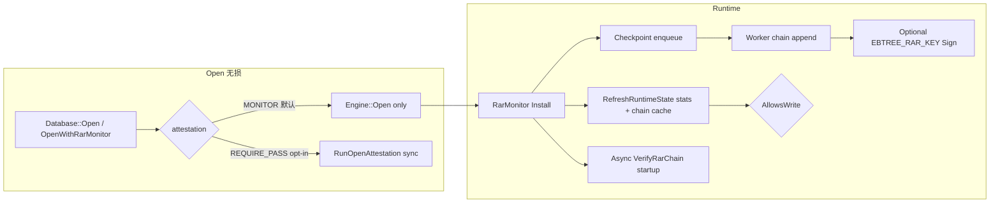

# RAR Standard SKU 产品化归档

**归档日期**：2026-07-01  
**状态**：RAR 动态链（ADR-038）+ Standard SKU 默认 MONITOR（ADR-040）均已落地；Release 下 `P14-rar-product`、`P14-rar-dynamic`、`P9-audit-complete`（33 项）全绿。  
**前置归档**：[rar-kernel-implementation-2026-07-01.md](rar-kernel-implementation-2026-07-01.md)（内核联动初版）  
**规范入口**：[ADR-040](../../adr/040-rar-standard-sku-defaults.md) · [ADR-038](../../adr/038-rar-kernel-full-auditability.md) · [ADR-026](../../adr/026-rar-v2-signing-and-sidecars.md)

---

## 1. 产品 SKU 决策（Standard 默认态）

| 层级 | Standard 默认 | 行为 |
|------|---------------|------|
| **L0** | `attestation_async=true` + async chain | Checkpoint post-commit 仅入队；JSON/IO 在 worker |
| **L1** | `AttestationMode::kMonitor` | Open **不**跑同步 `BuildRar`；运行期双轨写熔断 |
| **L2** | opt-in `REQUIRE_PASS` / `ALLOW_WARN` | Open 同步 BuildRar + 门禁 |
| **签名** | `EBTREE_RAR_KEY` 存在则 worker 自动签 chain body | 无 key → 一次性 WARN，不阻塞 checkpoint/Open |

**不采用**：Standard 默认 Open 同步全量 `BuildRar`（与「常开无损」冲突）。



### 1.1 默认接线表

| 表面 | 默认值 | 文件 |
|------|--------|------|
| `OpenOptions::attestation` | `kMonitor` | `sql/session/open_options.h` |
| `OpenStmt::attestation` | `kMonitor` | `sql/ast/minimal_ast.h` |
| C API `attestation_mode` 零初始化 / `0` | MONITOR | `EBTREE_SQL_ATTEST_DEFAULT` |
| C API 显式关闭 | `EBTREE_SQL_ATTEST_OFF = 1` | `c_api/ebtree_sql.h` |
| `EngineOptions::attestation_async` | `true` | `cpp/include/ebtree/common/config.h` |

### 1.2 AttestationMode 四级门禁（更新后）

| 模式 | SQL 语法 | Open | 运行期写 | async chain |
|------|----------|------|----------|-------------|
| `kOff` | `WITH ATTESTATION OFF`（测试 seed 显式） | 直接 Open | 允许 | 若 async |
| **`kMonitor`** | **默认 / `MONITOR`** | 跳过同步 BuildRar | **双轨违规拒写** | 开启 |
| `kRequirePass` | `REQUIRE_PASS` | 同步 BuildRar，仅 PASS | 允许 | 可选 |
| `kAllowWarn` | `ALLOW_WARN` | PASS 或 WARN | 允许 | 可选 |

---

## 2. Audit 层产品核心（`tools/ebtree_audit/`）

`RarMonitor` 已从 `sql/session/` **迁至 audit 层**，SQL 通过 `ebtree_audit_lib` 链接使用。

### 2.1 RarMonitor（L1 闭环）

文件：`rar_monitor.h` / `rar_monitor.cc`

| 能力 | 说明 |
|------|------|
| `Install` / `Stop` | 启动 chain worker + 注册 CheckpointObserver |
| `RefreshRuntimeState` | **双轨熔断**：`stats_ok && chain_ok` |
| `AllowsWrite` | false → SQL DML 返回 `Corrupt("rar monitor: write circuit open")` |
| `StatusSnapshot` | PRAGMA / C API 数据源 |
| `StartStartupVerify` | Install 后后台 `VerifyRarChain`，不阻塞 Open |
| `WarnChainDrop` | 对比 `rar_chain_drop_total` 增量；可选 `reject_on_chain_drop` |
| `OpenWithRarMonitor` | KV 产品入口：`Engine::Open` + Install |

**双轨写熔断逻辑**：

```text
stats_ok:  unexpected_path_total == 0（可配置）
           decompress_fail_total <= max_decompress_fail
chain_ok:  last_chain_verdict == PASS（首条快照前默认 PASS）
allows_write = stats_ok && chain_ok   （write_circuit 开启时）
```

**RarMonitorOptions**：

| 字段 | 默认 | 含义 |
|------|------|------|
| `enabled` | true | 总开关 |
| `chain_path` | `{path}/ebtree.rar.chain.jsonl` | sidecar chain |
| `op_log_path` | `{path}/ebtree.op_log.jsonl` | op_log head hash |
| `write_circuit` | MONITOR 时为 true | 是否启用写熔断 |
| `reject_on_chain_drop` | false | drop 时是否拒写（默认仅 WARN） |
| `runtime_policy` | require_unexpected_path_zero, max_decompress_fail=0 | PolicyGate 子集 |

### 2.2 RarChainWorker 扩展

文件：`rar_chain_worker.h` / `rar_chain_worker.cc`

| 扩展 | 说明 |
|------|------|
| `on_snapshot` 回调 | append 前 `EvaluateSnapshotPolicy` → 回调 verdict/reason/sequence |
| `MaybeSignEntry` | 读 `EBTREE_RAR_KEY` → `SignRarJson(body_json)` |
| rotate 检查 | `ReadLastRarChainEntry` O(1) 尾读 → 超 10k 条 rotate |
| 尾读优化 | 单次 tail 读替代三次全链扫描（perf gate 关键） |

### 2.3 Chain 运维

| 模块 | 文件 | 职责 |
|------|------|------|
| `ReadLastRarChainEntry` | `rar_chain.cc` | 反向读末行，O(文件大小) 最坏但无全链 parse |
| `RotateRarChainIfNeeded` | `rar_chain_rotate.cc` | 超限 rename → `{stem}.{ts}.bak.jsonl` |
| `VerifyRarChain` | `rar_chain.cc` | sequence 单调 + hash 链连续 |

### 2.4 KV 产品头文件

`cpp/include/ebtree/engine/engine_rar.h` → `#include "rar_monitor.h"`（需 link `ebtree_audit_lib`）

---

## 3. SQL 集成（`sql/`）

### 3.1 Database 接线

文件：`sql/session/database.cc`

- 构造时 `InstallRarMonitor()` + `InstallGroupCommitObserver()`
- `MakeRarMonitorOptions`：`kMonitor` 或 `attestation_async` 时 enabled + write_circuit
- `Execute`：拦截 `PRAGMA rar_status` → `ExecRarStatusPragma`
- 写语句前 `RefreshRuntimeState` + `AllowsWrite` 检查
- `rar_monitor()` 只读访问器

### 3.2 可观测性

**PRAGMA rar_status**（`sql/exec/pragma_exec.cc` + `database.cc`）

| key | 来源 |
|-----|------|
| `allows_write` | `RarMonitor::AllowsWrite()` |
| `unexpected_path_total` | `engine->stats()` |
| `decompress_fail_total` | stats |
| `rar_chain_drop_total` | stats |
| `last_chain_sequence` | monitor 缓存 |
| `last_chain_verdict` | PASS / REFUSE |
| `last_chain_reason` | string |
| `startup_chain_consistent` | 异步启动校验结果 |
| `worker_running` | worker 状态 |

**C API**：`ebtree_sql_rar_status()` → `ebtree_sql_rar_status_t`（同数据源）

### 3.3 边界（保持 ADR-026）

- **仅** `sql/session/attestation.cc` 调用 `audit::BuildRar`（L2 Open）
- `sql/exec/pragma_exec` 通过前向声明 + `ExecRarStatusPragma` 避免 executor 层直接依赖 monitor 生命周期

---

## 4. 内核层（不变要点，见前置归档）

| 组件 | 要点 |
|------|------|
| `AttestExportSnapshot` | 无探针；chain worker 专用 |
| `CheckpointObserver` | post-commit enqueue-only |
| `EngineStats` | unexpected_path / decompress_fail / rar_chain_drop |
| `attestation_async` | 默认 true |

---

## 5. 签名

| 场景 | 覆盖对象 | 触发 |
|------|----------|------|
| Open RAR 报告 | BuildRar v3 canonical JSON | CLI `sign` / L2 Open |
| **Chain entry** | **`body_json`**（strip-signature canonical） | worker `MaybeSignEntry` |

- 环境变量：`EBTREE_RAR_KEY`（32-byte seed / hex）
- 构建：`EBTREE_RAR_SIGNING=ON` → Ed25519；否则 stub + WARN
- 无 key：worker 启动一次性 stderr WARN，不影响写入

---

## 6. 测试与 Gate

### 6.1 新增 / 扩展测试

| 测试 | 套件 | 验证点 |
|------|------|--------|
| `SqlRarMonitor.DefaultOpenIsMonitor` | sql | 默认 Open + worker 运行 |
| `SqlRarMonitor.PragmaRarStatus` | sql | PRAGMA key/value |
| `SqlRarMonitor.WriteCircuitOpenOnUnexpectedPath` | sql | stats 轨写熔断 |
| `EbPipelinePerf.KBalancedWrite100kWithRarMonitor` | pipeline | ≥0.99× raw baseline（Release） |
| `RarChainAutoSign` | audit | `EBTREE_RAR_KEY` + signing build |
| `RarChainRoundtrip` / `RarAsyncCheckpoint` | audit | chain 连续性 |
| `RarChainPerf` | audit | observer ≥0.99×（Release） |

### 6.2 Gate 矩阵

| Gate | 套件 | 用途 |
|------|------|------|
| `P9-audit-complete` | audit | 全 RAR 回归（33 tests） |
| `P14-rar-dynamic` | audit, sql | 动态链 + MONITOR |
| **`P14-rar-product`** | sql, audit, pipeline | **产品默认态封板** |

```powershell
.\scripts\test\run_tests.ps1 -Gate P14-rar-product -Config Release
.\scripts\test\run_tests.ps1 -Gate P9-audit-complete -Config Release
```

### 6.3 Release 验证快照（2026-07-01）

| Gate | 结果 |
|------|------|
| `P14-rar-product` | ✅ 10 tests passed |
| `P9-audit-complete` | ✅ 33 tests passed |
| `KBalancedWrite100kWithRarMonitor` | ✅ ≥0.99×（尾读优化后 ~1.8s） |

---

## 7. 验收清单（产品化计划）

| 项 | 状态 |
|----|------|
| SQL/C API 默认 MONITOR，Open 无同步 BuildRar | ✅ |
| `KBalancedWrite100k` 默认 RAR 常开 ≥0.99× baseline | ✅ |
| MONITOR 写熔断：stats **或** chain policy 违规均拒写 | ✅ |
| `PRAGMA rar_status` 可查询 allows_write / drop / chain verdict | ✅ |
| `EBTREE_RAR_KEY` 设置时 chain entry 含 signature | ✅（signing build） |
| 无 key 时 WARN 不签，不影响写入与 checkpoint | ✅ |
| KV `OpenWithRarMonitor` 与 SQL 行为一致 | ✅ |
| `P14-rar-product` + `P9-audit-complete` 全绿 | ✅ |
| `REQUIRE_PASS` opt-in 路径回归不变 | ✅ |

---

## 8. 源码索引（产品化后）

### Audit（产品核心）

| 路径 | 说明 |
|------|------|
| `tools/ebtree_audit/rar_monitor.h/cc` | L1 MONITOR + OpenWithRarMonitor |
| `tools/ebtree_audit/rar_chain_worker.h/cc` | async worker + on_snapshot + sign |
| `tools/ebtree_audit/rar_chain_rotate.h/cc` | chain rotate |
| `tools/ebtree_audit/rar_chain.h/cc` | chain IO + ReadLastRarChainEntry |
| `tools/ebtree_audit/rar_builder.cc` | BuildRar v3（L2 Open） |
| `tools/ebtree_audit/policy_gate.cc` | EvaluateSnapshotPolicy |
| `cpp/include/ebtree/engine/engine_rar.h` | KV 头文件转发 |

### SQL

| 路径 | 说明 |
|------|------|
| `sql/session/database.cc` | Install + 写熔断 + PRAGMA |
| `sql/session/open_options.h` | 默认 kMonitor |
| `sql/session/attestation.cc` | L2 Open 门禁 |
| `sql/exec/pragma_exec.cc` | ExecRarStatusPragma |

### C API

| 路径 | 说明 |
|------|------|
| `c_api/ebtree_sql.h` | ATTEST_DEFAULT/OFF + rar_status |
| `c_api/ebtree_sql.cc` | ParseAttestation + ebtree_sql_rar_status |

### 文档

| 路径 | 说明 |
|------|------|
| `Docs/adr/040-rar-standard-sku-defaults.md` | 产品默认规范 |
| `Docs/adr/038-rar-kernel-full-auditability.md` | 动态链规范 |

---

## 9. 双无损设计（产品常开验证）

**Perf 无损**

- Checkpoint 热路径：observer → `Enqueue` only
- chain tail 读：每 job 一次 `ReadLastRarChainEntry`（非三次全链 parse）
- Release perf：`KBalancedWrite100kWithRarMonitor` ≥ 0.99× `ProductionDefaults`

**Durability 无损**

- Observer 严格 post-commit
- chain IO / queue drop 不 rollback checkpoint
- Open（MONITOR）与运行期 chain 解耦

---

## 10. 已知边界与后续

| 项 | 状态 |
|----|------|
| 实时 chain 完整 tier 探针 | 未做；仍留给 Open `BuildRar` |
| rotate 跨 bak 文件 verify | 可选后续 |
| HSM / 密钥轮换 | 文档建议；未内置 |

---

*本归档为 ADR-040 产品化完成态只读快照；后续变更以 ADR 与 git 历史为准。*
